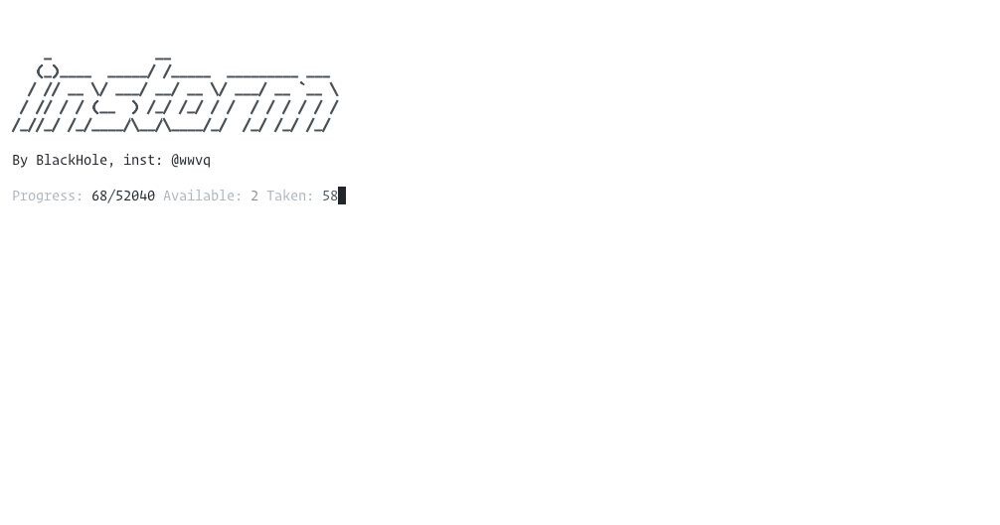
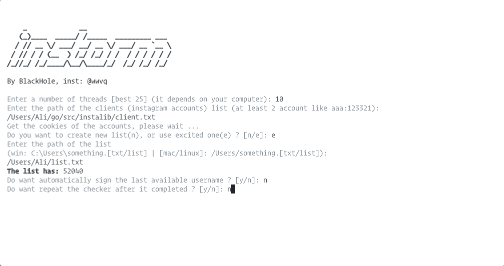

# instorm
instagram checker written in go language.

# installation
```
git clone github.com/justghostz/instorm-checker.git ~/go/src/instorm-checker
```
# libraries
```
go get github.com/fatih/color
go get github.com/google/uuid
```
# run
```
go run instorm-checker
```
# build
```
go build instorm-checker
```




# about
instagram @fenllz

a little note: this is an old program, maybe it doesn't work anymore

